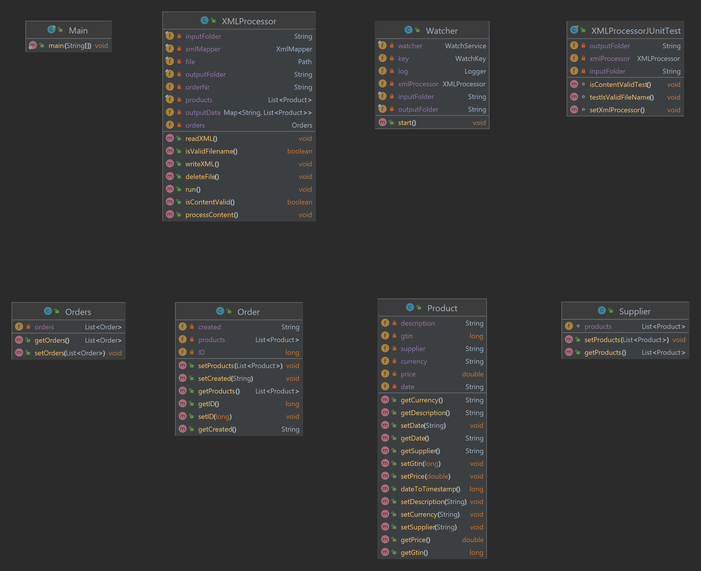

# FileWatcher

## Configuration

### - set input/output directories in "resources/application.properties"

## How it works?

### - using WatchService API, the program listens for directory changes (using an infinite loop)
### - when ".xml" file is received, it is processed on a different thread
### - the file is first validated (both filename and content type)
### - the file is deserialized using jackson-dataformat-xml library, then it is deleted from the input folder
### - the products are added a date so that we can sort them later
### - the products are sorted descendant after their date and grouped after the corresponding supplier using Stream API and put in a hashmap with the supplier as the key and the products list as the value
### - for every supplier in the hashmap we serialize our products list and output it in the corresponding xml file

## Dependencies

### - WatchService API (watches registered objects for changes and events)
### - Jackson-dataformat-xml (popular, easy to use xml serializer / deserializer)
### - Lombok (less boiler plate code)
### - Commons-configuration (get values from "resources/application.properties")
### - JUnit (testing)

## Classes Diagram Picture

